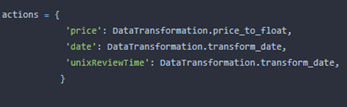
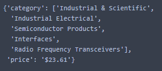
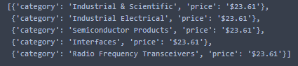

Amazon offers services for the sale of things. 
Products are divided into categories, but they can also belong to several categories at once.

## DATASETS

You are provided with two JSON files:

1) __'Industrial_and_Scientific_updated.json'__

Each string of JSON has the followed format:

```python
{'overall': 5.0, 'verified': True, 
'reviewTime': '01 23, 2013',
'reviewerID': 'A3FANY5GOT5X0W',
'asin': '0176496920',
'reviewerName': 'Kelly Keyser', 
'summary': 'Just as described!', 
'unixReviewTime': '01/23/2013'
}
```

__Each key has logical information:__

 * _reviewerID_ - ID of the reviewer 
 * _asin_ - ID of the product
 * _reviewerName_ - name of the reviewer
 * _vote_ - helpful votes of the review
 * _overall_ - rating of the product
 * _summary_ - summary of the review
 * _unixReviewTime_ - time of the review (unix time)
 * _reviewTime_ - time of the review (raw)

2) __'meta_Industrial_and_Scientific_updated.json'__

Each string of JSON has followed the format:

```python
{'category': 'Industrial & Scientific',
'also_buy': ['0781776821', '078177683X', '0781776783', '1572226846', '0781782422'], 
'also_view': [], 
'date': '08/07/2007', 
'price': 10.37, 
'asin': '0781776848',
}
```

__Each key has logical information:__

* _asin_ - ID of the product
* _price_ - price in US dollars (at time of crawl)
* _categories_ - list of categories the product belongs to
* _date_ – the date of purchasing.
* _also_buy_ – list of products that were bought with the main product.
* _also_view_ – list of product that were viewed with the main product.

The data is absolutely real and you will be convinced of this by selecting any value of the "asin" key in the data set and you can insert it into the system link https://www.amazon.com/dp/{asin value}/. 
Note that customer and product data can be combined by product ID.


## Tasks

### Task 1
Write implementations of functions below in a __'aggregate functions.py'__ module.

#### Task 1.1

Implement function `inner_join(...)` alike __INNER JOIN__ from SQL. What is more, function needs to have parameters such as:

* `review_data` - data from  __'Industrial_and_Scientific_updated.json'__;
* `metadata` - data from __'meta_Industrial_and_Scientific_updated.json'__;
* `columns_names - names of columns which will join up. __NOTE:__ names of columns have to be the same.

This function needs to return a list of updated dictionaries.


#### Task 1.2
Implement the "group_by(...)" function that accepts data in the format of any _.json_ described above, as well as a list of columns by which the grouping should be performed.
The function can return a dictionary, where the keys are the columns by which the grouping was carried out, and the values are the lists that satisfy the grouping conditions.

__ADVICE__: use __itertools.groupby__.

__Example__
```python
>>> group_by([{'Dad': 33, 'Mom': 30}, {'Dad': 22, 'Mom': 10}])
{'Dad': [33, 22], 'Mom': [30, 10]}
```

#### Task 1.3
Implement the "delete_columns(...)" function, which accepts the same arguments as function from __TASK 1.2__. 
In the body of the function, describe the logic for deleting keys and their values inside dictionaries, based on the list of keys passed to the function argument.
The function should delete keys in the passed dataset, but return nothing.


### Task 2
Implement the `FeatureTransformer` class with the static methods from _TASKS_ below. Save this class in `transformers.py`.

#### Task 2.1
Implement the `transform_date(...)` method with following parameters:
Implement the `transform_date(..)` method which takes the value of the __'date'__ or __'unixReviewTime'__ key of either of the two above json's as an argument.
In the body of the function you need to implement the logic for converting the received date into the 'month/day/year' format. 
If the function parameter receives an empty string or the received date cannot be converted to the specified type, then the function must return the default value. 

__PARAMETERS__:
* _date_ - date from `date` or `unixReviewTime` column. 

__DEFAULT__: "01/01/2018".
__NOTE__: you can use exception.

#### Task 2.2
Write the `price_to_float(...)` method that takes the value of the __"price"__ key from the dictionary.
In the body of the function, write the number to the logic that extracts after the __"$"__ sign from the string passed to the function, and then translates it into a floating-point number, rounded to two decimal places.
If the passed function can be empty, or for some reason, the number cannot be extracted from the string, the function returns 0.
It is required to create a dictionary `dict: actions`, where keys will be names of keys from both __TASK 2.1 and TASK 2.2__. 
The values in this dictionary will be references to functions that perform actions on their keys in the `FeatureTransformation` class.

__PARAMETERS__:
* _price_ - value from `price` key.

__NOTE__: you can use exception.
__DEFAULT__: 0.
_ANSWER_:


### Task 3
Implement the `DataParser` class, whose constructor takes two values:
* `path_to_json`
* `number_of_lines` - the number of lines to read from the file.

#### Task 3.1
Implement the `get_data_iterator(...)` method, which takes the same parameters as the constructor.
In the body of the method, you need to check for the existence of the passed file path. 
If such a path does not exist, then an Exception should be raised with the message __("Incorrect path")__.
If the path exists, this method should be able to open a json file and read information from line by line. 
In this case, each line must be returned by the yield statement, thereby you implement an iterator function.

#### Task 3.2
Implement an method-iterator that accepts a dictionary from json and name of key.
If a given key contains nesting in the dictionary, for example, a non-empty list, then on its basis you need to create a set of new dictionaries that differ only in the value in the passed key containing nesting and return one at a time by the yield statement.
If the given key is not in the dictionary, then it is required to return the original dictionary with the yield statement.

__EXAMPLE__:
_FROM_

_TO_

